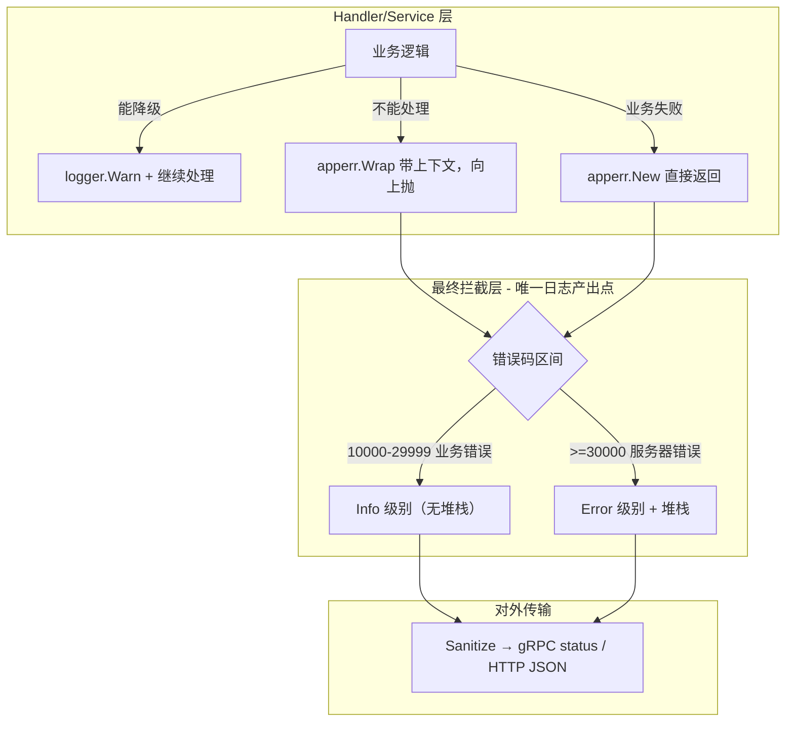

# 日志与错误处理统一迁移方案

## 目标架构



### 日志产出点白名单

- **user / msg 服务**：`pkg/grpcx` 的 `LoggingUnaryInterceptor`（请求结束日志）、`RecoveryUnaryInterceptor`（panic）、降级点 Warn、`cmd/main.go` 启动日志
- **gateway**：`GinLogger`（HTTP 请求结束日志）、`GRPCLoggerInterceptor`（出站 gRPC 调用日志）、`GinRecovery`（panic）、降级点 Warn、`cmd/main.go` 启动日志
- **connect**：同 gateway 的 Gin/gRPC 中间件 + WebSocket 生命周期日志（连接建立/断开/推送失败等，因不属于 request-response 模式，必须保留）
- **repository / mq**：仅降级点 Warn（如 Redis 降级重试、异步任务失败等）

---

## Phase 0：`apperr` 包增强

### 0.1 修改 `Error()` 使其包含 cause 链

**文件**：[`pkg/apperr/error.go`](pkg/apperr/error.go)

当前 `Error()` 只返回 `e.message`，不包含被包装的原始错误信息。迁移后 service 层不再打日志，拦截器通过 `logger.ErrorField("error", err)` 输出 `err.Error()`，必须包含完整上下文。

```go
func (e *Error) Error() string {
    if e == nil {
        return ""
    }
    msg := e.message
    if msg == "" {
        msg = consts.GetMessage(e.Code())
    }
    if e.cause != nil {
        return msg + ": " + e.cause.Error()
    }
    return msg
}
```

效果示例：
- `apperr.New(CodeParamError).Error()` → `"参数错误"`（无 cause，不变）
- `apperr.Wrap(dbErr, CodeInternalError, "创建用户失败").Error()` → `"创建用户失败: connection refused"`

**安全性**：`Message()` 方法不变（只返回 `e.message`），`Sanitize` 使用 `Message()` 构建对外错误，cause 不会泄露到客户端。`ToStatus` 用的也是 `Message()`。

### 0.2 `Sanitize` 改为始终使用标准码文案

**文件**：[`pkg/apperr/grpc.go`](pkg/apperr/grpc.go) 第 82-92 行

当前 `Sanitize` 用 `Message(err)` 保留了自定义 Wrap message。对外应统一使用码表文案，避免内部操作描述（如 "创建用户失败"）暴露到 gRPC 响应：

```go
func Sanitize(err error) error {
    if err == nil {
        return nil
    }
    code := Code(err)
    clean := NewWithMessage(code, consts.GetMessage(code))
    if IsLogged(err) {
        MarkLogged(clean)
    }
    return clean
}
```

效果：`Wrap(dbErr, CodeInternalError, "创建用户失败")` 经 Sanitize 后，gRPC status.Message 变为 `"系统内部错误"`，而非 `"创建用户失败"`。

### 0.3 更新测试

**文件**：[`pkg/apperr/error_test.go`](pkg/apperr/error_test.go)

- 增加 `Error()` 含 cause 链的断言
- 增加 `Sanitize` 使用标准码文案的断言
- 现有 `Wrap`/`WithStack` 测试中 `Error()` 返回值会变，需对齐

---

## Phase 1：gRPC 服务端拦截器重构

### 拦截器执行顺序（不变）

```
Recovery(外) → Metadata → RateLimit → Metrics → ErrorNormalize → Logging(内) → Handler
```

Logging 最先看到 handler 返回的原始 `*apperr.Error`（含 cause 和堆栈），ErrorNormalize 随后将其转为干净的 gRPC status。

### 1.1 ErrorNormalize → 去掉全部日志，只做转换

**文件**：[`pkg/grpcx/error_normalize.go`](pkg/grpcx/error_normalize.go)

当前（第 20-31 行）对 `>= 30000` 错误打 Error 日志 + MarkLogged + WithStack。**全部移除**，只保留纯转换：

```go
func ErrorNormalizeUnaryInterceptor() grpc.UnaryServerInterceptor {
    return func(ctx context.Context, req interface{}, info *grpc.UnaryServerInfo, handler grpc.UnaryHandler) (interface{}, error) {
        resp, err := handler(ctx, req)
        if err == nil {
            return resp, nil
        }
        appErr := apperr.FromStatus(err)
        return resp, apperr.ToStatus(apperr.Sanitize(appErr))
    }
}
```

### 1.2 Logging → 承接错误日志职责（核心变更）

**文件**：[`pkg/grpcx/logging.go`](pkg/grpcx/logging.go)

当前逻辑：
- 错误时 `>= 30000` → Error，其余 → Warn
- 成功慢 → Warn，成功快 → Info

改为（保持签名不变）：

```go
resp, err = handler(ctx, req)
cost := time.Since(start)

fields := []zap.Field{
    logger.String("method", info.FullMethod),
    logger.Duration("cost", cost),
    logger.String("grpc_code", status.Code(err).String()),
}

if err != nil {
    appErr := apperr.WithStack(err) // 安全网：确保有堆栈
    code := apperr.Code(appErr)
    fields = append(fields,
        logger.Int("business_code", code),
        logger.ErrorField("error", appErr),
    )
    if code >= 30000 {
        // 服务器错误 → Error + 堆栈
        fields = append(fields,
            logger.String("top_frame", apperr.TopFrame(appErr)),
            logger.StackFrames("stack", apperr.Frames(appErr)),
        )
        logger.Error(ctx, "gRPC 请求完成", fields...)
        apperr.MarkLogged(appErr)
    } else {
        // 业务错误 → Info（无堆栈）
        logger.Info(ctx, "gRPC 请求完成", fields...)
    }
    return resp, appErr
}

// 成功
if cfg.SlowThreshold > 0 && cost >= cfg.SlowThreshold {
    logger.Warn(ctx, "gRPC 慢请求", fields...)
} else {
    logger.Info(ctx, "gRPC 请求完成", fields...)
}
return resp, nil
```

关键变化：
- 业务错误 (10000-29999)：**Warn → Info**
- 服务器错误 (>=30000)：Error 不变，但**新增 top_frame + stack 字段**
- `MarkLogged`：在此标记，避免重复

### 1.3 更新 server.go 注释

**文件**：[`pkg/grpcx/server.go`](pkg/grpcx/server.go) 第 73-74 行注释不准确（缺少 ErrorNormalize），修正：

```
// 执行顺序：Recovery(最外层) → Metadata → RateLimit → Metrics → ErrorNormalize → Logging(最内层)
// Logging 负责所有请求日志（成功/业务错误/服务器错误），ErrorNormalize 仅做 error→status 转换
```

### 1.4 更新测试

**文件**：[`pkg/grpcx/error_normalize_test.go`](pkg/grpcx/error_normalize_test.go)

- 移除对日志输出的断言（如果有）
- 验证 ErrorNormalize 不再 MarkLogged（Logging 负责）
- 验证输出是干净的 gRPC status（无 cause、无 stack）

---

## Phase 2：Gateway HTTP 中间件重构

### 2.1 GinLogger 合并错误日志能力

**文件**：[`apps/gateway/internal/middleware/gin_logger.go`](apps/gateway/internal/middleware/gin_logger.go)

当前只按 HTTP status 分级。改为同时读取 `business_code` 和 `c.Errors`（由 `result.FailServer` 注入）：

```go
func GinLogger() gin.HandlerFunc {
    return func(c *gin.Context) {
        start := time.Now()
        path := c.Request.URL.Path
        query := c.Request.URL.RawQuery
        clientIP := ctxmeta.ClientIPFromGin(c)
        if clientIP == "" {
            clientIP = c.ClientIP()
        }

        c.Next()

        if path == "/health" && c.Writer.Status() < 500 {
            return
        }

        ctx := NewContextWithGin(c)
        cost := time.Since(start)
        statusCode := c.Writer.Status()
        fields := []zap.Field{
            logger.String("method", c.Request.Method),
            logger.String("path", path),
            logger.String("query", query),
            logger.String("ip", clientIP),
            logger.Int("status", statusCode),
            logger.Duration("cost", cost),
        }

        businessCode := 0
        if code, exists := c.Get("business_code"); exists {
            if bc, ok := code.(int); ok && bc > 0 {
                businessCode = bc
                fields = append(fields, logger.Int("business_code", bc))
            }
        }

        // 从 c.Errors 提取上游错误详情（堆栈等）
        if len(c.Errors) > 0 {
            for _, ge := range c.Errors {
                if ge.Err == nil {
                    continue
                }
                fields = append(fields, logger.ErrorField("error", ge.Err))
                if top := apperr.TopFrame(ge.Err); top != "" {
                    fields = append(fields, logger.String("top_frame", top))
                    fields = append(fields, logger.StackFrames("stack", apperr.Frames(ge.Err)))
                }
                break // 只取第一条
            }
        }

        switch {
        case businessCode >= 30000:
            logger.Error(ctx, "Gateway HTTP 请求完成", fields...)
        case statusCode >= 500:
            logger.Error(ctx, "Gateway HTTP 请求完成", fields...)
        case cost > 2*time.Second:
            logger.Warn(ctx, "Gateway HTTP 慢请求", fields...)
        default:
            logger.Info(ctx, "Gateway HTTP 请求完成", fields...)
        }
    }
}
```

需要新增 import：`"github.com/013677890/LCchat-Backend/pkg/apperr"`

### 2.2 删除 gateway_error_log.go

**文件**：`apps/gateway/internal/middleware/gateway_error_log.go` → **删除**

其职责已合并到 GinLogger。

### 2.3 更新 router.go

**文件**：[`apps/gateway/internal/router/router.go`](apps/gateway/internal/router/router.go)

删除第 36 行：
```go
r.Use(middleware.GatewayUpstreamErrorLogger())  // 删除此行
```
同步删除对应注释（第 35 行）。

### 2.4 调整 gRPC 客户端拦截器日志级别

**文件**：[`apps/gateway/internal/middleware/grpc_logger.go`](apps/gateway/internal/middleware/grpc_logger.go)

此拦截器记录 Gateway 调下游 gRPC 服务的日志。调整日志级别与服务端保持一致：

- 第 30-34 行：业务错误（<30000）从 **Warn → Info**
- 其余不变

```go
if apperr.Code(appErr) >= 30000 {
    logger.Error(ctx, "Gateway gRPC 请求完成", fields...)
} else {
    logger.Info(ctx, "Gateway gRPC 请求完成", fields...)  // Warn → Info
}
```

### 2.5 Recovery 中间件保持不变

**文件**：[`apps/gateway/internal/middleware/recover.go`](apps/gateway/internal/middleware/recover.go)

panic 发生时 GinLogger 的 `c.Next()` 后代码不会执行（panic 中断了调用栈），Recovery 的 `defer recover()` 是唯一能记录 panic 的地方。**保持现有逻辑不变**。

---

## Phase 3：User 服务 service 层清理（最大改动，约 190 处 logger 调用）

### 迁移规则

对 5 个 service 文件，逐个 logger 调用按以下规则处理：

| 当前模式 | 迁移后 |
|---------|--------|
| `logger.Error` + `return apperr.New(code)` | 删除 logger，改为 `return apperr.Wrap(err, code, "操作描述")` |
| `logger.Warn` + `return apperr.New(code)` | 删除 logger，直接 `return apperr.New(code)` |
| `logger.Warn` + 继续处理（降级）| **保留 Warn**（降级是允许打日志的场景） |
| `logger.Info`（成功日志）| **删除**（由拦截器的请求完成日志覆盖） |
| `logger.Error` + `return apperr.New(code)` 且无原始 err | 删除 logger，`return apperr.New(code)` 不变 |

### 具体示例

**示例 1：服务器错误 + 有 cause**
```go
// Before（auth_service.go ~140 行）：
logger.Error(ctx, "创建用户失败",
    logger.String("email", req.Email),
    logger.ErrorField("error", err),
)
return nil, apperr.New(consts.CodeInternalError)

// After：
return nil, apperr.Wrap(err, consts.CodeInternalError, "创建用户失败")
```

拦截器日志输出效果：
```json
{"level":"error","msg":"gRPC 请求完成","method":"/user.UserService/Register","business_code":30001,"error":"创建用户失败: duplicate key value violates unique constraint","top_frame":"service/auth_service.go:141","stack":[...]}
```

**示例 2：业务错误（无 cause）**
```go
// Before：
logger.Warn(ctx, "用户已存在", logger.String("email", req.Email))
return nil, apperr.New(consts.CodeUserAlreadyExist)

// After：
return nil, apperr.New(consts.CodeUserAlreadyExist)
```

拦截器日志输出效果：
```json
{"level":"info","msg":"gRPC 请求完成","method":"/user.UserService/Register","business_code":11001,"error":"用户已存在"}
```

**示例 3：降级（保留 Warn）**
```go
// Before & After 均保留：
logger.Warn(ctx, "写入设备活跃时间失败", logger.ErrorField("error", err))
// 继续执行，不 return error
```

### 3.1 auth_service.go（约 51 处 logger 调用）

**文件**：`apps/user/internal/service/auth_service.go`

- 移除约 40 处 `logger.Error/Warn` + `return apperr.New` 配对
- 对有 cause 的 Error 改为 `apperr.Wrap(err, code, "描述")`
- **保留** 约 5 处降级 Warn（如写入设备活跃时间失败、删除验证码失败、递增计数失败）
- 移除约 6 处 `logger.Info`（登录成功、注册成功、验证码发送成功等）

### 3.2 friend_service.go（约 50 处）

**文件**：`apps/user/internal/service/friend_service.go`

- 与 auth_service 同理
- 保留降级 Warn

### 3.3 user_service.go（约 59 处）

**文件**：`apps/user/internal/service/user_service.go`

### 3.4 device_service.go（约 18 处）

**文件**：`apps/user/internal/service/device_service.go`

### 3.5 blacklist_service.go（约 11 处）

**文件**：`apps/user/internal/service/blacklist_service.go`

### 3.6 repository/errors.go

**文件**：`apps/user/internal/repository/errors.go`

`LogRedisError` 当前用 Error 级别，但场景是「Redis 失败，请求继续」，属降级 → **改为 Warn**。

`LogAndRetryRedisError` 保留（降级 + 重试队列）。

### 3.7 repository/apply_repository.go

**文件**：`apps/user/internal/repository/apply_repository.go`

三处 logger 调用均在异步 goroutine（非请求主路径）中，**保留**。

### 3.8 mq/redis_consumer.go

后台消费者，非请求路径，**保留**。

### 3.9 cmd/main.go

启动/停机日志，**保留**。

---

## Phase 4：Msg 服务清理

### 4.1 handler/msg_handler.go — 移除手动日志

**文件**：[`apps/msg/internal/handler/msg_handler.go`](apps/msg/internal/handler/msg_handler.go)

`mapMsgDomainError` 和 `mapConvDomainError` 的 `default` 分支（第 158-166 行、174-181 行）当前手动打 Error + MarkLogged。**删除日志，只保留错误映射**：

```go
func mapMsgDomainError(ctx context.Context, err error) error {
    switch {
    case errors.Is(err, msgsvc.ErrMessageNotFound):
        return apperr.New(consts.CodeMessageNotFound)
    // ... 其他 case 不变 ...
    default:
        return apperr.Wrap(err, consts.CodeInternalError, "消息处理失败")
    }
}

func mapConvDomainError(ctx context.Context, err error) error {
    switch {
    case errors.Is(err, convsvc.ErrConversationNotFound):
        return apperr.New(consts.CodeConversationNotFound)
    default:
        return apperr.Wrap(err, consts.CodeInternalError, "会话处理失败")
    }
}
```

`ctx` 参数可以保留（不破坏签名）或移除。`apperr.Wrap` 自动捕获堆栈，gRPC Logging 拦截器会处理日志。

### 4.2 domain/conversation/service.go

- **保留** `logger.Warn`（异步超时降级，第 203、217 行）
- **移除** `logger.Error`（会传递的错误，第 93、120、284、294、312、327 行）→ 这些错误最终会被 handler 映射为 apperr，由拦截器记录

### 4.3 domain/message/service.go

- **保留** `logger.Warn`（回写幂等缓存失败，第 176 行 — 降级）
- **保留** `logger.Info`（幂等缓存命中，第 111 行 — 这是值得记录的特殊业务路径）
- **移除** `logger.Info`（创建消息成功，第 182 行）和 `logger.Error`（撤回失败，第 286 行）

### 4.4 usecase 层

- **保留** 所有 `logger.Warn`（标注「不阻断」的降级场景，如 Kafka 投递失败、会话更新失败）
- **移除** 所有 `logger.Info`（发送成功、撤回成功、标记已读成功等）

---

## Phase 5：Connect 服务

### 判断依据

Connect 有两个接口面：
1. **gRPC 服务端**（接收 PushMessage 等 RPC）→ 使用标准 `grpcx` 拦截器链，**与 user/msg 一致**
2. **WebSocket 长连接**（ws_handler / svc）→ 不是 request-response，**没有请求结束拦截器**

### 5.1 gRPC 侧 — 无额外变更

[`apps/connect/internal/grpc/server.go`](apps/connect/internal/grpc/server.go) 第 42-53 行已使用标准 `grpcx` 拦截器链。Phase 1 的变更自动生效。

### 5.2 WebSocket 生命周期日志 — 保留

WebSocket 连接可能持续数小时，连接事件（建立、认证失败、断开、推送失败）无法被任何 middleware 捕获。以下日志**全部保留**：
- `ws_handler.go`：连接建立、升级失败、消息处理
- `svc/auth.go`：Token 校验失败
- `svc/lifecycle.go`：连接关闭、推送失败
- `svc/connect_service.go`：消息序列化错误

日志级别建议对齐：
- 认证失败 → Warn（业务可预期）
- 推送失败 → Warn（降级）
- 连接断开 → Info（正常生命周期）

### 5.3 Gin 中间件

[`apps/connect/internal/middleware/gin_logger.go`](apps/connect/internal/middleware/gin_logger.go) 和 [`recover.go`](apps/connect/internal/middleware/recover.go) 的改动与 Gateway 对齐即可（gin_logger 加 business_code 判断，recover 保持）。

### 5.4 中间件顺序修正（附带）

当前 Connect 顺序是 `Trace → ClientIP → GinLogger → Recover → CORS`，与 Gateway（`Recovery → Trace → ClientIP → GinLogger → ...`）不同。如果 handler 在 GinLogger 之后、Recover 之前 panic，日志行为可能不一致。建议统一为 **Recovery 在最外层**（但这不是本次迁移的核心，可选做）。

---

## Phase 6：Gateway handler / service 层

### 6.1 user_handle.go — 移除一处 Warn

**文件**：[`apps/gateway/internal/router/v1/user_handle.go`](apps/gateway/internal/router/v1/user_handle.go)

第 355-359 行 MinIO 上传失败的 `logger.Warn` 后跟 `result.Fail`。应改为 `result.FailServer(c, err, consts.CodeInternalError)`，让 GinLogger 统一记录错误：

```go
// Before:
logger.Warn(ctx, "上传文件到 MinIO 失败", ...)
result.Fail(c, nil, consts.CodeInternalError)

// After:
result.FailServer(c, err, consts.CodeInternalError)
```

### 6.2 Gateway service 层降级 Warn — 保留

以下文件中的 `logger.Warn` 均为「调用失败但降级返回」场景，符合新规则，**全部保留**：

- [`user_service.go`](apps/gateway/internal/service/user_service.go)：好友关系查询失败降级（第 105、162 行）
- [`friend_service.go`](apps/gateway/internal/service/friend_service.go)：批量获取用户信息失败降级（第 75、128、234、289 行）
- [`blacklist_service.go`](apps/gateway/internal/service/blacklist_service.go)：批量获取用户信息失败降级（第 75 行）

### 6.3 其他中间件 — 保留

- **rate_limit.go**：所有 Warn 均为限流降级/阻断场景 → 保留
- **timeout.go**：超时 Warn → 保留
- **pb/client.go**：熔断器状态变化 Info → 保留

---

## Phase 7：Repository / 基础设施层

**原则**：Repository 层使用标准 Go 错误（`errors.New` 哨兵 + `WrapDBError`/`WrapRedisError`），不使用 `apperr`。业务码映射在 service 层完成。**此层无结构性变更**。

唯一调整：
- `apps/user/internal/repository/errors.go` 的 `LogRedisError`：Error → **Warn**（降级场景）

---

## Phase 8：测试更新

### 8.1 Gateway router 集成测试（5 个文件）— 替换 status.Error mock

**文件**：
- `apps/gateway/internal/router/router_auth_test.go`
- `apps/gateway/internal/router/router_user_test.go`
- `apps/gateway/internal/router/router_device_test.go`
- `apps/gateway/internal/router/router_friend_test.go`
- `apps/gateway/internal/router/router_blacklist_test.go`

当前使用旧式 `status.Error(codes.Code(consts.X), "biz")` 模拟下游 gRPC 错误。改为：

```go
// Before:
bizErr := status.Error(codes.Code(tt.bizCode), strconv.Itoa(tt.bizCode))

// After:
bizErr := apperr.ToStatus(apperr.New(tt.bizCode))
```

或直接返回 `apperr.New(tt.bizCode)`（因为 Gateway service 透传 error，Gateway handler 的 `ExtractErrorCode` 能处理 `*apperr.Error`）。

注意：这些测试 mock 的是 gRPC client 的返回值。在真实场景中，gRPC client 收到的是 gRPC status（经 ErrorNormalize 的 `ToStatus`）。所以用 `apperr.ToStatus(apperr.New(...))` 最贴近真实。

### 8.2 Gateway v1 handle 测试（6 个文件）— 同上

**文件**：
- `apps/gateway/internal/router/v1/auth_handle_test.go`
- `apps/gateway/internal/router/v1/user_handle_test.go`
- `apps/gateway/internal/router/v1/device_handle_test.go`
- `apps/gateway/internal/router/v1/friend_handle_test.go`（部分已用 `apperr.New`，统一即可）
- `apps/gateway/internal/router/v1/blacklist_handle_test.go`

### 8.3 Gateway service 测试（6 个文件）— 断言调整

**文件**：
- `apps/gateway/internal/service/auth_service_test.go`
- `apps/gateway/internal/service/user_service_test.go`
- `apps/gateway/internal/service/device_service_test.go`
- `apps/gateway/internal/service/friend_service_test.go`
- `apps/gateway/internal/service/blacklist_service_test.go`
- `apps/gateway/internal/service/msg_service_test.go`

这些测试大多用 `errors.New("grpc unavailable")` mock 下游错误。Gateway service 透传这些 error，handler 用 `ExtractErrorCode` 提取。`ExtractErrorCode` 对非 `*apperr.Error` 返回 `CodeInternalError`。**基本无需改动**，但需验证 `Error()` 变更不影响 `ErrorIs` 断言。

### 8.4 User service 测试（5 个文件）— Error() 变更影响

**文件**：
- `apps/user/internal/service/auth_service_test.go`
- `apps/user/internal/service/user_service_test.go`
- `apps/user/internal/service/device_service_test.go`
- `apps/user/internal/service/friend_service_test.go`
- `apps/user/internal/service/blacklist_service_test.go`

关键：这些测试使用 `requireXXXStatusCode` 辅助函数验证 `apperr.Code` 和 `apperr.ToStatus` / `apperr.FromStatus` 往返。

- `apperr.Code(err)` 不受 `Error()` 变更影响
- `apperr.ToStatus` 使用 `Message()`（不含 cause） → 不受影响
- `apperr.FromStatus` 从 status.Message 还原 → 不受影响

**需要改动的场景**：如果 service 代码从 `apperr.New(code)` 改为 `apperr.Wrap(err, code, msg)`，测试中 mock 的 repository 返回值需要对应调整（确保有 cause 可 Wrap）。

### 8.5 User handler 测试（5 个文件）— 基本无变更

Handler 是薄层（直接调 service 返回 error），测试用 `errors.New` mock service 错误。Handler 不做日志，**无需改动**。

### 8.6 error_code_test.go — 验证兼容性

**文件**：`apps/gateway/internal/utils/error_code_test.go`

验证 `ExtractErrorCode` 对 `apperr.Wrap`（新增 cause 后）的兼容性。

### 8.7 _achieve/ 归档测试

4 个文件为历史归档测试。如果仍在编译范围内，需检查是否引用了被删除的 `GatewayUpstreamErrorLogger`。

---

## 影响范围汇总

| 区域 | 改动文件数 | 改动性质 |
|------|-----------|---------|
| `pkg/apperr/` | 2 (+tests) | Error() 含 cause、Sanitize 用标准码文案 |
| `pkg/grpcx/` | 3 (+tests) | ErrorNormalize 去日志、Logging 增强、server.go 注释 |
| Gateway 中间件 | 4 (改2/删1/改router) | GinLogger 合并、删 ErrorLogger、router 更新 |
| Gateway handler | 1 | user_handle.go 一处 Warn→FailServer |
| User service | 5 | ~190 处 logger 调用移除/替换 |
| Msg handler | 1 | 2 处手动日志移除 |
| Msg domain/usecase | 4 | ~10 处 logger 移除（保留降级 Warn） |
| Connect | 1 | gin_logger 对齐（可选） |
| Repository | 1 | LogRedisError Error→Warn |
| 测试 | ~20+ | mock 从 status.Error→apperr.ToStatus、断言对齐 |
| **合计** | **~40+ 文件** | |

## 建议执行顺序

Phase 0 → Phase 1 → Phase 8（pkg 测试）→ Phase 3 → Phase 8（user 测试）→ Phase 4 → Phase 2 → Phase 8（gateway 测试）→ Phase 6 → Phase 5 → Phase 7

先改底层（apperr、拦截器），再改上层（service、middleware），最后处理边缘（connect、repository）。每个 phase 完成后运行对应测试确认不破坏。
