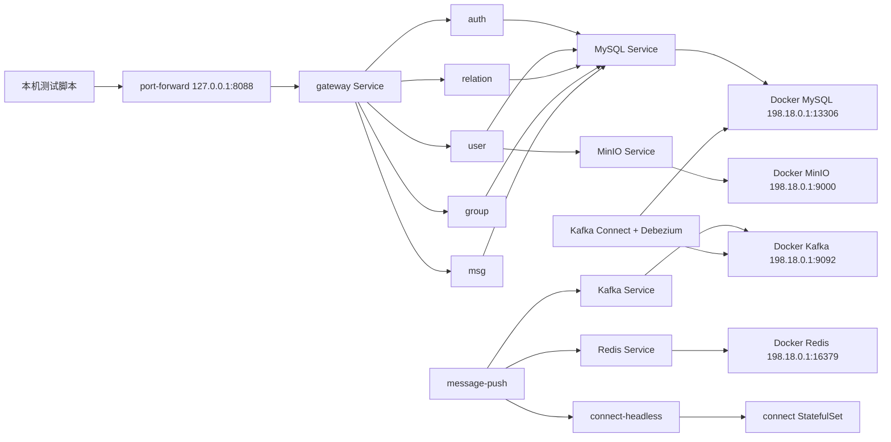

# LCChat k3s 应用层迁移方案

本文面向本地开发验证环境，描述当前已经落地的 WSL2 原生 k3s 部署方案。LCChat 应用服务运行在 k3s 中，MySQL、Redis、Kafka、Kafka Connect、Debezium 和 MinIO 继续复用 Windows Docker Compose。

## 1. 当前边界

- 迁移范围：`gateway`、`auth`、`user`、`relation`、`group`、`msg`、`connect`、`message-push`。
- 不迁移范围：MySQL、Redis、Kafka、Kafka Connect、Debezium、MinIO。
- 本地验证副本数：所有应用服务均为 1 个副本，降低本地资源占用并避免排查时引入额外重平衡噪声。
- 部署组织方式：Kustomize。
- 本地入口：不再使用 Ingress，使用 `kubectl port-forward svc/gateway 8088:8080`。

## 2. 目录结构

```text
deploy/k8s/
  base/
    common-configmap.yaml
    common-secret.yaml
    auth.yaml
    user.yaml
    relation.yaml
    group.yaml
    msg.yaml
    gateway.yaml
    connect.yaml
    message-push.yaml
    kustomization.yaml
  overlays/
    dev/
      namespace.yaml
      external-infra.yaml
      kustomization.yaml
      patches/
        replicas.yaml
        dev-configmap.yaml
        dev-secret.yaml
```

## 3. 当前拓扑



## 4. 关键设计

### 4.1 外部基础设施通过 Service + Endpoints 接入

`deploy/k8s/overlays/dev/external-infra.yaml` 为 MySQL、Redis、Kafka、MinIO 创建同名 Service 与 Endpoints。Pod 仍按服务名访问基础设施，例如：

```text
MYSQL_HOST=mysql
REDIS_ADDR=redis:6379
KAFKA_BROKERS=kafka:9092
MINIO_ENDPOINT=minio:9000
```

当前 WSL2 原生 k3s 通过 `198.18.0.1` 访问 Windows Docker 暴露端口：

| 依赖 | Endpoint |
| --- | --- |
| MySQL | `198.18.0.1:13306` |
| Redis | `198.18.0.1:16379` |
| Kafka | `198.18.0.1:9092` |
| MinIO | `198.18.0.1:9000` |

### 4.2 connect 使用 StatefulSet

`connect` 不是因为需要持久卷才使用 StatefulSet，而是因为在线路由中保存了具体 connect 节点的 gRPC 地址。

Redis 路由格式：

```text
user:routing:{user_uuid}
  {device_id} => {connectGrpcAddr}|{lastActiveMs}
```

因此 `message-push` 必须能按 Redis 中的地址直连持有 WebSocket 连接的 connect Pod。当前方案使用：

```text
$(POD_NAME).connect-headless.$(POD_NAMESPACE).svc.cluster.local:9091
```

不要把 `CONNECT_SELF_GRPC_ADDR` 配成普通 Service 地址，否则请求可能被负载均衡到错误 Pod。

### 4.3 普通服务使用 Deployment

以下服务使用 `Deployment + ClusterIP Service`：

- `gateway`
- `auth`
- `user`
- `relation`
- `group`
- `msg`
- `message-push`

它们通过 Kubernetes Service 名称互相访问，例如 `auth:9090`、`group:9095`、`msg:9092`。

### 4.4 CDC 必须保持运行

注册、资料更新、账号注销等跨服务一致性依赖 MySQL outbox + Debezium CDC（变更数据捕获）：

1. 业务服务在事务内写入 `outbox_events`；
2. Debezium connector 监听 MySQL binlog；
3. `EventRouter` 按 `event_type` 路由到 Kafka topic；
4. 下游服务消费 topic 并补齐本地状态。

因此 Docker Compose 中 `kafka-connect` 必须保持 healthy，且 `cdc-init` 至少成功执行过一次。

## 5. 镜像准备

当前清单使用二进制版镜像：

```text
lcchat:dev-bin-4
```

构建镜像：

```powershell
docker build -t lcchat:dev-bin-4 .
```

导入 k3s containerd：

```powershell
docker save lcchat:dev-bin-4 -o lcchat-dev-bin-4.tar
wsl -d Ubuntu-22.04 -- sudo k3s ctr images import /mnt/c/Users/23156/Desktop/go/LCChat/lcchat-dev-bin-4.tar
```

导入后删除临时 tar 包，避免误提交大文件。

## 6. 部署与查看

应用清单：

```powershell
wsl -d Ubuntu-22.04 -- sudo kubectl apply -k /mnt/c/Users/23156/Desktop/go/LCChat/deploy/k8s/overlays/dev
```

查看状态：

```powershell
wsl -d Ubuntu-22.04 -- sudo kubectl -n lcchat-dev get pods,svc,endpoints -o wide
```

启动 gateway 本地入口：

```powershell
wsl -d Ubuntu-22.04 -- sudo kubectl -n lcchat-dev port-forward svc/gateway 8088:8080
```

健康检查：

```powershell
curl.exe -s -o NUL -w "%{http_code}" http://127.0.0.1:8088/health
```

## 7. 验证清单

1. `docker compose ps mysql redis kafka kafka-connect minio` 均为 healthy；
2. `curl.exe -s http://127.0.0.1:8083/connectors/lcchat-outbox-connector/status` 显示 connector 和 task 均为 `RUNNING`；
3. `kubectl -n lcchat-dev get pods` 中所有业务 Pod 为 `Running`；
4. `gateway` 健康检查返回 `200`；
5. 按[端到端功能测试](../ops/端到端功能测试.md)设置 port-forward 地址，至少跑通认证、资料、二维码和设备状态相关的 Go E2E 用例。

## 8. 当前方案限制

- 本地验证不启用 Ingress，统一通过 port-forward 访问 gateway。
- 当前副本数为 1，主要用于单机稳定联调；需要验证多副本时再调高 replicas。
- Kafka advertised listener 必须保证 k3s Pod 可访问；当前依赖 `Service + Endpoints` 和 Docker Kafka 的 `kafka:9092` 配置。
- `kubectl logs` 在当前 WSL2 环境可能遇到 kubelet EOF，必要时使用 `crictl logs` 读取容器日志。

更详细的当前联调进度见：[k3s 本地部署与接口联调](../ops/k3s本地部署与接口联调.md)。
