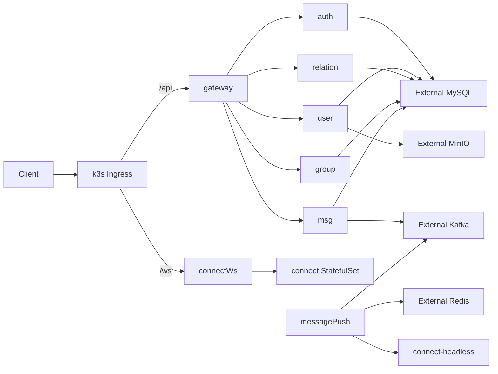

# LCChat k3s 应用层迁移方案

本文面向学习与开发验证环境，目标是先把 LCChat 应用服务迁移到 k3s，基础设施继续复用外部 MySQL、Redis、Kafka、Kafka Connect 和 MinIO。

## 1. 当前边界

- 迁移范围：`gateway`、`auth`、`user`、`relation`、`group`、`msg`、`connect`、`message-push`。
- 不迁移范围：MySQL、Redis、Kafka、Kafka Connect、Debezium、MinIO。
- 默认副本数：所有应用服务均为 2 个副本，用于验证多实例服务发现和下行推送。
- 部署组织方式：Kustomize。

## 2. 目录结构

```text
deploy/k8s/
  base/
    common-configmap.yaml
    common-secret.yaml
    auth.yaml
    user.yaml
    relation.yaml
    group.yaml
    msg.yaml
    gateway.yaml
    connect.yaml
    message-push.yaml
    ingress.yaml
    kustomization.yaml
  overlays/
    dev/
      namespace.yaml
      kustomization.yaml
      patches/
        replicas.yaml
        dev-configmap.yaml
        dev-secret.yaml
```

## 3. 拓扑



## 4. 关键设计

### 4.1 connect 使用 StatefulSet

`connect` 不是因为需要持久卷才使用 StatefulSet，而是因为在线路由中保存了具体 connect 节点的 gRPC 地址。

Redis 路由格式：

```text
user:routing:{user_uuid}
  {device_id} => {connectGrpcAddr}|{lastActiveMs}
```

因此 `message-push` 必须能按 Redis 中的地址直连持有 WebSocket 连接的 connect Pod。当前方案使用：

```text
$(POD_NAME).connect-headless.$(POD_NAMESPACE).svc.cluster.local:9091
```

例如：

```text
connect-0.connect-headless.lcchat-dev.svc.cluster.local:9091
connect-1.connect-headless.lcchat-dev.svc.cluster.local:9091
```

不要在多副本场景把 `CONNECT_SELF_GRPC_ADDR` 配成 `connect:9091`，否则请求会被普通 Service 负载均衡到错误 Pod。

### 4.2 普通服务使用 Deployment

以下服务使用 `Deployment + ClusterIP Service`：

- `gateway`
- `auth`
- `user`
- `relation`
- `group`
- `msg`
- `message-push`

它们通过 Kubernetes Service 名称互相访问，例如 `auth:9090`、`group:9095`、`msg:9092`。

### 4.3 配置拆分

- 非敏感配置放在 `lcchat-common-config`。
- 敏感配置放在 `lcchat-secret`。
- 各服务监听地址与调用地址在各自 Deployment 中单独声明，避免同名变量在不同服务中语义冲突。

特别注意：`gateway` 必须配置 `GROUP_SERVICE_ADDR=group:9095`，否则代码会回退到 `localhost:9095`。

## 5. 部署前必须修改的占位配置

编辑 `deploy/k8s/overlays/dev/patches/dev-configmap.yaml`：

```yaml
MYSQL_HOST: CHANGE_ME_MYSQL_HOST
REDIS_ADDR: CHANGE_ME_REDIS_HOST:6379
KAFKA_BROKERS: CHANGE_ME_KAFKA_HOST:9092
MINIO_ENDPOINT: CHANGE_ME_MINIO_HOST:9000
MINIO_BASE_URL: http://CHANGE_ME_MINIO_HOST:9000
```

编辑 `deploy/k8s/overlays/dev/patches/dev-secret.yaml`：

```yaml
MYSQL_USER: CHANGE_ME_MYSQL_USER
MYSQL_PASSWORD: CHANGE_ME_MYSQL_PASSWORD
MINIO_ACCESS_KEY: CHANGE_ME_MINIO_ACCESS_KEY
MINIO_SECRET_KEY: CHANGE_ME_MINIO_SECRET_KEY
EMAIL_AUTH_CODE: CHANGE_ME_QQ_SMTP_AUTH_CODE
```

Kafka 还需要确认 `advertised.listeners` 返回的是 k3s Pod 可访问的 broker 地址，否则只改 `KAFKA_BROKERS` 不够。

## 6. 镜像准备

当前清单默认使用：

```text
lcchat:dev
```

现阶段为了学习验证，仍复用当前开发型 Dockerfile，通过 `workingDir + go run ./cmd` 启动各服务。

构建镜像：

```bash
docker build -t lcchat:dev .
```

如果 k3s 使用 containerd，通常还需要把镜像导入 k3s 节点，例如：

```bash
docker save lcchat:dev | sudo k3s ctr images import -
```

后续正式化时，再把 Dockerfile 改成多阶段构建和二进制启动。

## 7. 部署与查看

渲染清单：

```bash
kubectl kustomize deploy/k8s/overlays/dev
```

应用清单：

```bash
kubectl apply -k deploy/k8s/overlays/dev
```

查看状态：

```bash
kubectl -n lcchat-dev get pods,svc,ingress
```

查看日志：

```bash
kubectl -n lcchat-dev logs -l app.kubernetes.io/name=gateway -f
kubectl -n lcchat-dev logs -l app.kubernetes.io/name=connect -f
kubectl -n lcchat-dev logs -l app.kubernetes.io/name=message-push -f
```

## 8. 验证清单

1. `gateway` 健康检查：`GET http://lcchat.local/health`。
2. 登录接口能通过 `/api/v1/public/user/login` 访问。
3. WebSocket 能通过 `ws://lcchat.local/ws?token=...&device_id=...` 建连。
4. Redis 中在线路由值包含 `connect-0.connect-headless...` 或 `connect-1.connect-headless...`。
5. 发送消息后，下行链路 `msg -> Kafka -> message-push -> connect -> WebSocket client` 可达。
6. 删除或重启一个 connect Pod 后，路由能在 TTL 窗口内自愈。

## 9. 当前方案的限制

- 探针是开发验证级，只证明端口或进程基本可用，不代表所有外部依赖都 ready。
- `message-push` 两个副本共享 Kafka consumer group，实际并行度取决于 Kafka topic 分区数。
- `group`、`auth`、`user` 等服务内部消费者也会按 consumer group 参与重平衡，开发验证阶段可接受。
- 当前镜像仍是开发型镜像，正式环境应改成多阶段构建。
- 基础设施外置时，k3s Pod 到外部 MySQL、Redis、Kafka、MinIO 的网络必须提前打通。
