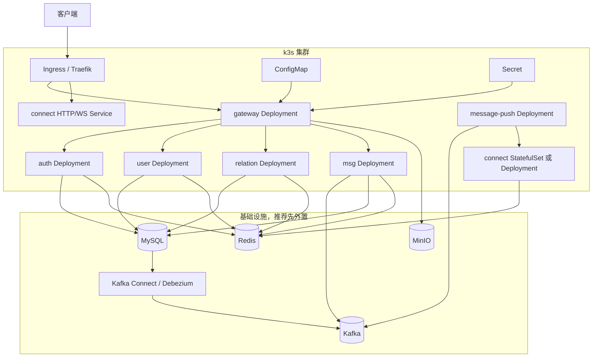

# LCChat k3s 迁移方案

> 目标：把当前基于 Docker Compose 的 LCChat 后端，分阶段迁移到 Kubernetes / k3s 管理，并明确迁移过程中的关键困难、风险和解决办法。

## 1. 结论摘要

LCChat 当前是典型的 Go 微服务后端，服务边界、环境变量配置、健康检查和 Prometheus 指标都已经具备较好的容器化基础，**适合迁移到 k3s**。

但不建议把 `docker-compose.yml` 机械翻译成 Kubernetes 清单后一次性上生产。推荐策略是：

1. **先迁无状态应用服务**：`gateway`、`auth`、`user`、`relation`、`msg`、`message-push`。
2. **谨慎迁移 connect**：先单副本跑通，再用 `StatefulSet`（有状态工作负载）+ `Headless Service`（无头服务）解决多副本自寻址问题。
3. **最后迁有状态基础设施**：Redis、MinIO、MySQL、Kafka、Kafka Connect / Debezium。
4. **生产环境优先使用外部稳定中间件**：尤其是 MySQL、Kafka、Kafka Connect / Debezium 这条 CDC（变更数据捕获）链路。

适合程度：

| 场景 | 适合度 | 建议 |
|---|---:|---|
| 本地 / 开发环境 k3s | 高 | 可以较快落地 |
| 测试 / 预发环境 k3s | 高 | 推荐先落地 |
| 生产环境只迁应用层 | 中高 | 推荐 |
| 生产环境全量自建中间件 | 中 | 需要额外运维能力 |

一句话原则：**应用先迁，中间件后迁；单副本先跑通，多副本再治理；开发测试先验证，生产最后推进。**

---

## 2. 当前部署现状

当前项目主要通过 `docker-compose.yml` 启动，整体包含业务服务和基础设施两大类。

### 2.1 业务服务

| 服务 | 当前运行方式 | 端口 | 职责 |
|---|---|---|---|
| `gateway` | `go run ./cmd` | HTTP `8080` | HTTP API 入口，JWT 鉴权，限流，转发 gRPC |
| `auth` | `go run ./cmd` | gRPC `9090`，metrics `9190` | 注册、登录、验证码、设备、账号安全 |
| `user` | `go run ./cmd` | gRPC `9094`，metrics `9194` | 用户资料、公开资料、搜索、二维码名片 |
| `relation` | `go run ./cmd` | gRPC `9093`，metrics `9193` | 好友、黑名单、好友申请 |
| `msg` | `go run ./cmd` | gRPC `9092`，metrics `9192` | 消息发送、撤回、已读、会话管理 |
| `connect` | `go run ./cmd` | HTTP/WS `8081`，gRPC `9091` | WebSocket 长连接、在线路由、下行推送入口 |
| `message-push` | `go run ./cmd` | HTTP `8084` | 消费 Kafka `msg.push`，调用 connect 下发 |

### 2.2 基础设施

| 组件 | 当前镜像 | 当前用途 | 是否有状态 |
|---|---|---|---:|
| MySQL | `mysql:8.0` | 业务数据库，Debezium CDC 来源 | 是 |
| Redis | `redis:7.2` | token、验证码、限流、缓存、在线路由 | 是 |
| Kafka | `apache/kafka:3.9.2` | 异步消息总线，`msg.push` 和领域事件 topic | 是 |
| Kafka Connect | `quay.io/debezium/connect:3.0.8.Final` | Debezium connector 运行时 | 是 |
| `cdc-init` | `curlimages/curl:8.13.0` | 一次性注册 Debezium Outbox connector | 否，Job 类任务 |
| MinIO | `minio/minio` | 对象存储，头像、二维码等资源 | 是 |

### 2.3 现有优点

1. **环境变量驱动**：大多数配置在 `deploy/env/chatserver.env.example` 中，适合迁到 `ConfigMap` / `Secret`。
2. **服务发现简单**：当前依赖 compose DNS，如 `auth:9090`、`redis:6379`，迁移后可以直接替换成 Kubernetes Service DNS。
3. **服务边界清晰**：HTTP、gRPC、WebSocket、消费者服务职责明确。
4. **健康检查已有基础**：`gateway`、`connect`、`message-push` 有 `/health`；gRPC 服务有 metrics HTTP 端口或 gRPC health 能力。
5. **日志和指标已容器友好**：服务暴露 `/metrics`，日志适合由容器标准输出采集。

### 2.4 现有短板

1. **当前 Dockerfile 更偏开发态**：镜像内包含 Go 工具链，服务用 `go run` 启动，不适合生产。
2. **依赖 compose `depends_on`**：Kubernetes 不能直接复用 `service_healthy` / `service_completed_successfully` 语义。
3. **有状态组件较多**：MySQL、Redis、Kafka、Kafka Connect、MinIO 都需要持久化、备份和故障恢复。
4. **connect 多副本存在自寻址问题**：`CONNECT_SELF_GRPC_ADDR` 需要代表“当前 Pod 的唯一可访问地址”。
5. **Kafka + Debezium CDC 链路复杂**：涉及 MySQL binlog、Kafka topic、Kafka Connect offset、schema history、connector 注册和恢复。

---

## 3. 目标架构

### 3.1 推荐目标拓扑



### 3.2 命名空间建议

建议使用独立命名空间：

```yaml
apiVersion: v1
kind: Namespace
metadata:
  name: lcchat
```

优点：

- 与其他系统隔离。
- 方便统一设置 `ResourceQuota`、`LimitRange`、`NetworkPolicy`。
- 方便按命名空间收集日志和指标。

---

## 4. 迁移总体原则

### 4.1 不直接照搬 docker-compose

Docker Compose 的核心能力是本地编排；Kubernetes 的核心能力是声明式调度、滚动发布、探针、服务发现和自愈。迁移时应从“容器启动顺序”转换为“服务自恢复能力”。

关键变化：

| Compose 思维 | Kubernetes 思维 |
|---|---|
| `depends_on` 控制启动顺序 | 应用重试 + readinessProbe（就绪探针）+ startupProbe（启动探针） |
| 容器名即 DNS | Service DNS |
| volume 简单持久化 | PVC + StorageClass + 备份恢复 |
| `go run` 临时启动 | 多阶段构建后的二进制镜像 |
| 所有组件一个文件启动 | 分层部署、分阶段验证、可回滚 |

### 4.2 先无状态，后有状态

优先迁移：

- `gateway`
- `auth`
- `user`
- `relation`
- `msg`
- `message-push`

谨慎迁移：

- `connect`

最后迁移：

- Redis
- MinIO
- MySQL
- Kafka
- Kafka Connect / Debezium

### 4.3 生产环境优先外置中间件

k3s 可以跑有状态服务，但生产稳定性取决于存储、备份、监控、故障恢复和运维能力。

生产推荐：

| 组件 | 推荐生产形态 |
|---|---|
| MySQL | 云数据库 / 独立主从集群 / 专门运维的 MySQL |
| Redis | 云 Redis / 哨兵 / Cluster |
| Kafka | 云 Kafka / 独立 Kafka 集群 / Strimzi 管理 |
| Kafka Connect | 独立部署或 Strimzi KafkaConnect |
| MinIO | 独立 MinIO 集群 / 云对象存储 |

开发测试可以先全部放进 k3s，生产不要一开始就这样做。

---

## 5. 服务到 Kubernetes 资源映射

### 5.1 业务服务映射

| 当前服务 | 推荐 Kubernetes 资源 | Service 类型 | 副本建议 | 首批迁移 | 说明 |
|---|---|---|---:|---:|---|
| `gateway` | `Deployment` | `ClusterIP` + `Ingress` | 2 | 是 | 对外 HTTP API 入口 |
| `auth` | `Deployment` | `ClusterIP` | 2 | 是 | 内部 gRPC 服务，metrics 单独端口 |
| `user` | `Deployment` | `ClusterIP` | 2 | 是 | 内部 gRPC 服务 |
| `relation` | `Deployment` | `ClusterIP` | 2 | 是 | 内部 gRPC 服务 |
| `msg` | `Deployment` | `ClusterIP` | 2 | 是 | 内部 gRPC 服务，依赖 Kafka |
| `message-push` | `Deployment` | `ClusterIP` | 1-2 | 是 | Kafka Consumer，扩容要确认消费组和幂等性 |
| `connect` 单副本 | `Deployment` | `ClusterIP` | 1 | 是 | 先跑通 WebSocket 和下行链路 |
| `connect` 多副本 | `StatefulSet` + `Headless Service` | `ClusterIP` + `Headless` | 2+ | 二阶段 | 解决 `CONNECT_SELF_GRPC_ADDR` 唯一地址问题 |

### 5.2 基础设施映射

| 当前组件 | 推荐 Kubernetes 资源 | 首批迁移 | 说明 |
|---|---|---:|---|
| MySQL | 外置优先；如入集群用 `StatefulSet` + PVC | 否 | 需要 binlog、备份、恢复、权限治理 |
| Redis | 外置优先；如入集群用 `StatefulSet` + PVC | 否 | 当前依赖 AOF，生产需高可用 |
| Kafka | 外置优先；如入集群推荐 Strimzi | 否 | 单 broker 只适合开发测试 |
| Kafka Connect | 外置优先；如入集群用 `Deployment` 或 Strimzi KafkaConnect | 否 | 与 Debezium connector、offset、schema history 相关 |
| `cdc-init` | `Job` | 否 | 使用 `PUT` 注册 connector，保持 Idempotent（幂等） |
| MinIO | 外置优先；如入集群用 `StatefulSet` + PVC | 否 | 注意内部 endpoint 和公开 URL 区分 |

---

## 6. 分阶段迁移计划

## 阶段 0：准备阶段

### 目标

准备 k3s 基础环境、镜像构建方式、配置和密钥模型，不迁移业务流量。

### 任务

1. 创建命名空间 `lcchat`。
2. 准备镜像仓库，例如：
   - 本地开发：`registry.localhost:5000`
   - 测试环境：Harbor / Docker Registry
   - 生产环境：云厂商镜像仓库 / Harbor
3. 改造 Dockerfile，生产镜像改为多阶段构建。
4. 梳理配置，拆分为：
   - `ConfigMap`：普通配置。
   - `Secret`：密码、SMTP 授权码、MinIO 密钥、数据库 DSN。
5. 决定基础设施位置：
   - 阶段 1 推荐全部外置或继续使用 compose 中间件。
   - k3s 内只跑业务服务。
6. 准备 Ingress 域名：
   - `api.lcchat.local` -> gateway。
   - `ws.lcchat.local` -> connect。
7. 确认 k3s 存储类：
   - 开发：默认 `local-path` 可接受。
   - 生产：建议 Longhorn / 云盘 CSI / 独立存储方案。

### 完成标准

- `kubectl get nodes` 正常。
- 镜像可以被 k3s 拉取。
- `lcchat` 命名空间存在。
- `ConfigMap` / `Secret` 设计完成。
- 外部 MySQL / Redis / Kafka / MinIO 地址可以从集群内访问。

---

## 阶段 1：迁移无状态业务服务

### 目标

先把应用层迁入 k3s，基础设施先外置，降低复杂度。

### 推荐顺序

1. `auth`
2. `user`
3. `relation`
4. `msg`
5. `connect` 单副本
6. `message-push`
7. `gateway`

### 为什么 gateway 最后迁

`gateway` 是对外入口，它依赖 `auth`、`user`、`relation`、`msg`。先保证内部 gRPC 服务可用，再暴露 gateway，排错更简单。

### 服务地址替换

Compose 中：

```env
AUTH_SERVICE_ADDR=auth:9090
USER_SERVICE_ADDR=user:9094
RELATION_SERVICE_ADDR=relation:9093
MSG_SERVICE_ADDR=msg:9092
```

k3s 中同命名空间下仍可使用短 DNS：

```env
AUTH_SERVICE_ADDR=auth:9090
USER_SERVICE_ADDR=user:9094
RELATION_SERVICE_ADDR=relation:9093
MSG_SERVICE_ADDR=msg:9092
```

如果跨命名空间，则使用完整 DNS：

```env
AUTH_SERVICE_ADDR=auth.lcchat.svc.cluster.local:9090
```

### 完成标准

- 所有业务 Pod `Ready`。
- `gateway /health` 返回 `200`。
- `connect /health` 返回 `200`。
- `message-push /health` 返回 `200`。
- gateway 可以调用 `auth`、`user`、`relation`、`msg`。
- WebSocket 可以连接 `connect`。
- 发送消息后，`message-push` 能消费 Kafka 并调用 `connect`。

---

## 阶段 2：治理 connect 多副本

### 目标

解决 WebSocket 长连接服务在 k3s 下横向扩容的问题。

### 单副本方案

开发和测试初期可以用单副本：

```env
CONNECT_SELF_GRPC_ADDR=connect:9091
```

这个方案简单，但只能代表一个 connect 实例。

### 多副本困难

`connect` 会把自身 gRPC 地址写入 Redis 路由表，`message-push` 根据路由回调对应 connect 节点。如果多个 Pod 都写同一个 `connect:9091`，普通 Service 会负载均衡到任意 Pod，可能导致消息被推到错误节点。

### 推荐多副本方案

使用：

- `StatefulSet`：给每个 connect Pod 稳定名称，如 `connect-0`、`connect-1`。
- `Headless Service`：给每个 Pod 提供稳定 DNS。
- Downward API（向下传递 API）：把 Pod 名和命名空间注入环境变量。

最终每个 Pod 的地址类似：

```text
connect-0.connect-headless.lcchat.svc.cluster.local:9091
connect-1.connect-headless.lcchat.svc.cluster.local:9091
```

环境变量示例：

```yaml
env:
  - name: POD_NAME
    valueFrom:
      fieldRef:
        fieldPath: metadata.name
  - name: POD_NAMESPACE
    valueFrom:
      fieldRef:
        fieldPath: metadata.namespace
  - name: CONNECT_SELF_GRPC_ADDR
    value: "$(POD_NAME).connect-headless.$(POD_NAMESPACE).svc.cluster.local:9091"
```

### WebSocket Ingress 注意事项

WebSocket 是长连接，Ingress 层要关注：

1. 空闲超时时间不能太短。
2. 滚动升级时要允许旧连接优雅断开。
3. `terminationGracePeriodSeconds` 要足够长，例如 60 秒。
4. 可加 `preStop` 先睡眠 5-10 秒，让 Pod 从 Service Endpoint 摘除后再退出。

建议配置：

```yaml
terminationGracePeriodSeconds: 60
lifecycle:
  preStop:
    exec:
      command: ["sh", "-c", "sleep 10"]
```

### 完成标准

- 多个 connect Pod 都能写入不同 `CONNECT_SELF_GRPC_ADDR`。
- 用户连接在哪个 Pod，Redis 路由就指向哪个 Pod。
- `message-push` 能按路由调用正确 Pod 的 gRPC 地址。
- 滚动升级时不会出现大量异常断连。

---

## 阶段 3：迁移轻量状态组件

### 目标

把复杂度较低的状态组件逐步迁入 k3s。

推荐顺序：

1. Redis
2. MinIO
3. MySQL

### Redis 迁移建议

开发测试可以使用单实例：

- `StatefulSet`
- PVC
- AOF 开启

生产建议：

- 外部 Redis。
- 或 Redis Sentinel / Redis Cluster。
- 定期备份 RDB / AOF。

关键困难：

| 困难 | 解决方案 |
|---|---|
| Pod 重建导致数据丢失 | 使用 PVC 持久化 `/data` |
| 单点故障 | 生产使用外部高可用 Redis |
| Redis 短暂不可用影响业务 | 当前部分逻辑已有降级策略，但 token、路由等核心能力仍需要高可用 |

### MinIO 迁移建议

开发测试可以单实例：

- `StatefulSet`
- PVC 挂载 `/data`
- API 端口 `9000`
- Console 端口 `9001`

生产建议：

- 独立 MinIO 集群。
- 或直接使用云对象存储。

关键困难：

| 困难 | 解决方案 |
|---|---|
| 内部 endpoint 和外部访问 URL 混淆 | `MINIO_ENDPOINT=minio:9000`，`MINIO_BASE_URL=https://static.example.com` |
| bucket 初始化 | 使用一次性 `Job` 创建 bucket 和策略 |
| 数据备份 | 定期同步到外部对象存储或备份盘 |

### MySQL 迁移建议

开发测试可以单实例：

- `StatefulSet`
- PVC 挂载 `/var/lib/mysql`
- ConfigMap 注入初始化 SQL

生产建议：

- 优先外部 MySQL。
- 如果必须入集群，至少要有备份、恢复演练、主从或 Operator。

关键困难：

| 困难 | 解决方案 |
|---|---|
| 初始化 SQL 只适合空库 | 生产使用迁移工具或手工变更，不自动重放全量 schema |
| Debezium 依赖 binlog | MySQL 必须开启 `log-bin`、`binlog-format=ROW`、`binlog-row-image=FULL` |
| 数据恢复复杂 | 迁移前做全量备份，恢复流程必须演练 |
| 数据库账号权限 | 业务账号和 Debezium 账号分离，最小权限 |

---

## 阶段 4：迁移 Kafka、Kafka Connect 和 Debezium

### 目标

迁移最复杂的消息和 CDC 链路。

### 推荐策略

开发测试：

- 可以先在 k3s 内跑单 broker Kafka。
- Kafka Connect 使用 Deployment。
- `cdc-init` 使用 Job。

生产：

- 优先使用外部 Kafka 或 Strimzi。
- Kafka Connect 与 Kafka 版本、Debezium 版本要统一管理。
- connector 注册、offset、schema history 都要纳入备份和监控。

### Kafka 难点与解决

| 困难 | 风险 | 解决方案 |
|---|---|---|
| 单 broker 不可靠 | broker 挂掉消息链路中断 | 生产至少 3 broker，或使用云 Kafka |
| 存储性能不足 | 消费延迟、broker 不稳定 | 使用稳定 StorageClass，不建议生产用默认 local-path |
| advertised listeners 配置错误 | 服务无法连接 broker | k8s 内部使用 Service DNS，外部访问单独配置 listener |
| topic 自动创建不可控 | topic 参数不符合生产要求 | 生产关闭自动创建，使用 Job 或 GitOps 管理 topic |

### Kafka Connect / Debezium 难点与解决

| 困难 | 风险 | 解决方案 |
|---|---|---|
| Kafka Connect 依赖 Kafka ready | connector 注册失败 | `cdc-init` 做成 Job，内部循环等待 `/connectors` 可访问 |
| connector 重复注册 | 配置漂移或失败 | 使用 `PUT /connectors/{name}/config`，保持 Idempotent（幂等） |
| MySQL 账号权限不足 | CDC 无法读取 binlog | 创建专用 Debezium 用户并授予 `REPLICATION SLAVE`、`REPLICATION CLIENT`、必要表读权限 |
| schema history topic 丢失 | connector 无法恢复 | schema history topic 必须持久化，不能随意删除 |
| offset 丢失 | 可能重复投递或重新快照 | Connect offset topic 必须持久化，生产不允许随意清空 |
| 事件重复消费 | 下游重复处理 | 消费端必须按事件 ID 或业务 key 做幂等处理 |

### `cdc-init` 的 Kubernetes 形态

当前 `cdc-init` 是一次性容器，迁移到 k3s 后应使用 `Job`：

```yaml
apiVersion: batch/v1
kind: Job
metadata:
  name: cdc-init
  namespace: lcchat
spec:
  backoffLimit: 3
  template:
    spec:
      restartPolicy: OnFailure
      containers:
        - name: cdc-init
          image: curlimages/curl:8.13.0
          command: ["sh", "/scripts/register_outbox_connector.sh"]
          envFrom:
            - configMapRef:
                name: lcchat-config
            - secretRef:
                name: lcchat-secret
          volumeMounts:
            - name: cdc-script
              mountPath: /scripts/register_outbox_connector.sh
              subPath: register_outbox_connector.sh
              readOnly: true
      volumes:
        - name: cdc-script
          configMap:
            name: cdc-init-script
            defaultMode: 0755
```

注意：生产环境中 connector 配置变更要有变更流程，不建议每次发布都无脑重跑。

---

## 7. 配置与密钥设计

### 7.1 ConfigMap 建议

普通配置放入 `ConfigMap`：

```yaml
apiVersion: v1
kind: ConfigMap
metadata:
  name: lcchat-config
  namespace: lcchat
data:
  TZ: "Asia/Shanghai"
  GIN_MODE: "release"

  MYSQL_HOST: "mysql"
  MYSQL_PORT: "3306"
  MYSQL_DATABASE: "chat_server"
  MYSQL_LOG_LEVEL: "warn"

  REDIS_HOST: "redis"
  REDIS_PORT: "6379"
  REDIS_ADDR: "redis:6379"
  REDIS_DB: "0"
  REDIS_POOL_SIZE: "20"
  REDIS_MIN_IDLE_CONNS: "4"
  REDIS_MAX_RETRIES: "3"

  KAFKA_BROKERS: "kafka:9092"
  KAFKA_MSG_PUSH_TOPIC: "msg.push"
  KAFKA_MSG_PUSH_GROUP_ID: "message-push-consumer-group"
  KAFKA_USER_CREATED_TOPIC: "user_created"
  KAFKA_PROFILE_DISPLAY_CHANGED_TOPIC: "profile_display_changed"
  KAFKA_ACCOUNT_DELETED_TOPIC: "account.deleted"

  MINIO_ENDPOINT: "minio:9000"
  MINIO_BUCKET: "chatserver"
  MINIO_BASE_URL: "https://static.example.com"
  MINIO_USE_SSL: "false"
  MINIO_PUBLIC_READ: "true"

  AUTH_SERVICE_ADDR: "auth:9090"
  USER_SERVICE_ADDR: "user:9094"
  RELATION_SERVICE_ADDR: "relation:9093"
  MSG_SERVICE_ADDR: "msg:9092"
  GATEWAY_ADDR: ":8080"

  AUTH_GRPC_ADDR: ":9090"
  AUTH_METRICS_ADDR: ":9190"
  USER_GRPC_ADDR: ":9094"
  USER_METRICS_ADDR: ":9194"
  RELATION_GRPC_ADDR: ":9093"
  RELATION_METRICS_ADDR: ":9193"
  MSG_GRPC_ADDR: ":9092"
  MSG_METRICS_ADDR: ":9192"

  CONNECT_ADDR: ":8081"
  CONNECT_GRPC_ADDR: ":9091"
  MESSAGE_PUSH_HTTP_ADDR: ":8084"

  EMAIL_SENDER_NAME: "LCChat"
  EMAIL_SMTP_HOST: "smtp.qq.com"
  EMAIL_SMTP_PORT: "465"
```

### 7.2 Secret 建议

敏感配置放入 `Secret`：

```yaml
apiVersion: v1
kind: Secret
metadata:
  name: lcchat-secret
  namespace: lcchat
type: Opaque
stringData:
  MYSQL_USER: "root"
  MYSQL_PASSWORD: "CHANGE_ME"
  MYSQL_DSN: "root:CHANGE_ME@tcp(mysql:3306)/chat_server?charset=utf8mb4&parseTime=True&loc=Local"

  REDIS_PASSWORD: ""

  MINIO_ACCESS_KEY: "CHANGE_ME"
  MINIO_SECRET_KEY: "CHANGE_ME"

  EMAIL_SENDER: "example@qq.com"
  EMAIL_AUTH_CODE: "CHANGE_ME"

  DEBEZIUM_MYSQL_USER: "debezium"
  DEBEZIUM_MYSQL_PASSWORD: "CHANGE_ME"
```

注意：

- 不要提交真实 Secret。
- 生产建议使用 Sealed Secrets、External Secrets 或云厂商 Secret Manager。
- `MYSQL_DSN` 中包含密码，必须属于 Secret。

---

## 8. 镜像构建改造

### 8.1 当前问题

当前 Dockerfile 使用 `golang:1.25-alpine`，每个服务在容器里执行 `go run ./cmd`。

这适合开发，但生产存在问题：

- 镜像体积大。
- 启动慢。
- 运行时包含 Go 编译工具链。
- 安全面更大。
- 资源占用更高。

### 8.2 推荐多阶段 Dockerfile

建议改为按服务构建二进制：

```dockerfile
FROM golang:1.25-alpine AS builder

WORKDIR /src
ENV GOPROXY=https://goproxy.cn,direct

COPY go.mod go.sum ./
RUN go mod download

COPY . .

ARG SERVICE
RUN CGO_ENABLED=0 GOOS=linux GOARCH=amd64 \
    go build -trimpath -ldflags="-s -w" -o /out/app ./apps/${SERVICE}/cmd

FROM alpine:3.20

RUN addgroup -S app && adduser -S app -G app
WORKDIR /app

COPY --from=builder /out/app /app/app

USER app

ENTRYPOINT ["/app/app"]
```

构建示例：

```bash
docker build --build-arg SERVICE=gateway -t registry.example.com/lcchat/gateway:dev .
docker build --build-arg SERVICE=auth -t registry.example.com/lcchat/auth:dev .
docker build --build-arg SERVICE=user -t registry.example.com/lcchat/user:dev .
docker build --build-arg SERVICE=relation -t registry.example.com/lcchat/relation:dev .
docker build --build-arg SERVICE=msg -t registry.example.com/lcchat/msg:dev .
docker build --build-arg SERVICE=connect -t registry.example.com/lcchat/connect:dev .
docker build --build-arg SERVICE=message-push -t registry.example.com/lcchat/message-push:dev .
```

### 8.3 镜像标签建议

| 环境 | 标签策略 |
|---|---|
| 开发 | `dev`、`dev-日期` |
| 测试 | Git commit SHA，例如 `a1b2c3d` |
| 预发 | Git tag + SHA |
| 生产 | 语义化版本 + SHA，例如 `v1.3.0-a1b2c3d` |

生产不建议使用 `latest`。

---

## 9. Deployment 和 Service 模板

### 9.1 gRPC 服务模板，以 auth 为例

```yaml
apiVersion: apps/v1
kind: Deployment
metadata:
  name: auth
  namespace: lcchat
spec:
  replicas: 2
  selector:
    matchLabels:
      app: auth
  template:
    metadata:
      labels:
        app: auth
    spec:
      containers:
        - name: auth
          image: registry.example.com/lcchat/auth:dev
          ports:
            - name: grpc
              containerPort: 9090
            - name: metrics
              containerPort: 9190
          envFrom:
            - configMapRef:
                name: lcchat-config
            - secretRef:
                name: lcchat-secret
          env:
            - name: AUTH_GRPC_ADDR
              value: ":9090"
            - name: AUTH_METRICS_ADDR
              value: ":9190"
          readinessProbe:
            httpGet:
              path: /metrics
              port: metrics
            initialDelaySeconds: 5
            periodSeconds: 5
            timeoutSeconds: 3
            failureThreshold: 6
          livenessProbe:
            httpGet:
              path: /metrics
              port: metrics
            initialDelaySeconds: 20
            periodSeconds: 10
            timeoutSeconds: 3
            failureThreshold: 3
          resources:
            requests:
              cpu: 100m
              memory: 128Mi
            limits:
              cpu: 500m
              memory: 512Mi
---
apiVersion: v1
kind: Service
metadata:
  name: auth
  namespace: lcchat
spec:
  type: ClusterIP
  selector:
    app: auth
  ports:
    - name: grpc
      port: 9090
      targetPort: grpc
    - name: metrics
      port: 9190
      targetPort: metrics
```

说明：

- 当前 compose 使用 `/metrics` 判断 gRPC 服务是否可用，所以 k3s 初期可以沿用。
- 如果启用了 Kubernetes gRPC probe，也可以对 `9090` 使用 gRPC 健康探针。
- 长期建议给每个 metrics HTTP server 增加明确 `/health`，避免把指标接口当健康接口。

### 9.2 gateway 模板

```yaml
apiVersion: apps/v1
kind: Deployment
metadata:
  name: gateway
  namespace: lcchat
spec:
  replicas: 2
  selector:
    matchLabels:
      app: gateway
  template:
    metadata:
      labels:
        app: gateway
    spec:
      containers:
        - name: gateway
          image: registry.example.com/lcchat/gateway:dev
          ports:
            - name: http
              containerPort: 8080
          envFrom:
            - configMapRef:
                name: lcchat-config
            - secretRef:
                name: lcchat-secret
          readinessProbe:
            httpGet:
              path: /health
              port: http
            initialDelaySeconds: 5
            periodSeconds: 5
          livenessProbe:
            httpGet:
              path: /health
              port: http
            initialDelaySeconds: 20
            periodSeconds: 10
          resources:
            requests:
              cpu: 100m
              memory: 128Mi
            limits:
              cpu: 500m
              memory: 512Mi
---
apiVersion: v1
kind: Service
metadata:
  name: gateway
  namespace: lcchat
spec:
  type: ClusterIP
  selector:
    app: gateway
  ports:
    - name: http
      port: 8080
      targetPort: http
```

### 9.3 gateway Ingress 示例

```yaml
apiVersion: networking.k8s.io/v1
kind: Ingress
metadata:
  name: gateway
  namespace: lcchat
spec:
  ingressClassName: traefik
  rules:
    - host: api.lcchat.local
      http:
        paths:
          - path: /
            pathType: Prefix
            backend:
              service:
                name: gateway
                port:
                  number: 8080
```

### 9.4 connect 单副本模板

```yaml
apiVersion: apps/v1
kind: Deployment
metadata:
  name: connect
  namespace: lcchat
spec:
  replicas: 1
  selector:
    matchLabels:
      app: connect
  template:
    metadata:
      labels:
        app: connect
    spec:
      terminationGracePeriodSeconds: 60
      containers:
        - name: connect
          image: registry.example.com/lcchat/connect:dev
          ports:
            - name: http
              containerPort: 8081
            - name: grpc
              containerPort: 9091
          envFrom:
            - configMapRef:
                name: lcchat-config
            - secretRef:
                name: lcchat-secret
          env:
            - name: AUTH_GRPC_ADDR
              value: "auth:9090"
            - name: CONNECT_ADDR
              value: ":8081"
            - name: CONNECT_GRPC_ADDR
              value: ":9091"
            - name: CONNECT_SELF_GRPC_ADDR
              value: "connect:9091"
          readinessProbe:
            httpGet:
              path: /health
              port: http
            periodSeconds: 5
          livenessProbe:
            httpGet:
              path: /health
              port: http
            initialDelaySeconds: 20
            periodSeconds: 10
          lifecycle:
            preStop:
              exec:
                command: ["sh", "-c", "sleep 10"]
---
apiVersion: v1
kind: Service
metadata:
  name: connect
  namespace: lcchat
spec:
  type: ClusterIP
  selector:
    app: connect
  ports:
    - name: http
      port: 8081
      targetPort: http
    - name: grpc
      port: 9091
      targetPort: grpc
```

### 9.5 connect 多副本模板

```yaml
apiVersion: v1
kind: Service
metadata:
  name: connect-headless
  namespace: lcchat
spec:
  clusterIP: None
  selector:
    app: connect
  ports:
    - name: grpc
      port: 9091
      targetPort: grpc
---
apiVersion: apps/v1
kind: StatefulSet
metadata:
  name: connect
  namespace: lcchat
spec:
  serviceName: connect-headless
  replicas: 2
  selector:
    matchLabels:
      app: connect
  template:
    metadata:
      labels:
        app: connect
    spec:
      terminationGracePeriodSeconds: 60
      containers:
        - name: connect
          image: registry.example.com/lcchat/connect:dev
          ports:
            - name: http
              containerPort: 8081
            - name: grpc
              containerPort: 9091
          envFrom:
            - configMapRef:
                name: lcchat-config
            - secretRef:
                name: lcchat-secret
          env:
            - name: POD_NAME
              valueFrom:
                fieldRef:
                  fieldPath: metadata.name
            - name: POD_NAMESPACE
              valueFrom:
                fieldRef:
                  fieldPath: metadata.namespace
            - name: AUTH_GRPC_ADDR
              value: "auth:9090"
            - name: CONNECT_ADDR
              value: ":8081"
            - name: CONNECT_GRPC_ADDR
              value: ":9091"
            - name: CONNECT_SELF_GRPC_ADDR
              value: "$(POD_NAME).connect-headless.$(POD_NAMESPACE).svc.cluster.local:9091"
          readinessProbe:
            httpGet:
              path: /health
              port: http
          livenessProbe:
            httpGet:
              path: /health
              port: http
            initialDelaySeconds: 20
            periodSeconds: 10
          lifecycle:
            preStop:
              exec:
                command: ["sh", "-c", "sleep 10"]
```

还需要一个普通 Service 给 WebSocket 入口负载均衡：

```yaml
apiVersion: v1
kind: Service
metadata:
  name: connect
  namespace: lcchat
spec:
  type: ClusterIP
  selector:
    app: connect
  ports:
    - name: http
      port: 8081
      targetPort: http
```

### 9.6 connect Ingress 示例

```yaml
apiVersion: networking.k8s.io/v1
kind: Ingress
metadata:
  name: connect
  namespace: lcchat
spec:
  ingressClassName: traefik
  rules:
    - host: ws.lcchat.local
      http:
        paths:
          - path: /
            pathType: Prefix
            backend:
              service:
                name: connect
                port:
                  number: 8081
```

---

## 10. 替代 depends_on 的方案

### 10.1 当前问题

Compose 中大量使用：

```yaml
depends_on:
  mysql:
    condition: service_healthy
```

Kubernetes 不保证“依赖服务先启动完成”，也不建议依赖启动顺序保证可用性。

### 10.2 推荐解决方案

| 场景 | 解决方案 |
|---|---|
| 服务依赖 MySQL / Redis / Kafka | 应用启动时连接失败要重试；Pod 通过 readiness 控制是否接流量 |
| 初始化任务，如 `cdc-init` | 使用 `Job`，脚本内部等待依赖 ready |
| 数据库 schema 初始化 | 开发用 init SQL；生产用迁移工具或手工变更流程 |
| gateway 依赖后端服务 | readinessProbe 只代表 gateway 自身；业务调用失败由熔断、重试和错误处理兜底 |
| Kafka topic 初始化 | 使用单独 Job 或 GitOps 管理 topic |

### 10.3 应用侧建议

长期建议每个服务具备：

1. 依赖连接重试。
2. 优雅关闭。
3. readiness 只在关键依赖可用后返回成功。
4. liveness 不检查外部依赖，避免依赖抖动导致 Pod 被反复重启。

---

## 11. 网络和暴露策略

### 11.1 对外暴露

| 入口 | 推荐方式 | 说明 |
|---|---|---|
| gateway HTTP | Ingress | `api.lcchat.local` 或真实 API 域名 |
| connect WebSocket | Ingress | `ws.lcchat.local`，需要关注超时 |
| MinIO Console | 不建议公网暴露 | 需要认证和 IP 白名单 |
| Kafka / MySQL / Redis | 不公网暴露 | 仅集群内或专线访问 |

### 11.2 对内通信

| 调用方 | 被调用方 | 地址 |
|---|---|---|
| gateway | auth | `auth:9090` |
| gateway | user | `user:9094` |
| gateway | relation | `relation:9093` |
| gateway | msg | `msg:9092` |
| msg | user | `user:9094` |
| msg | relation | `relation:9093` |
| connect | auth | `auth:9090` |
| message-push | connect | Redis 路由中的 `CONNECT_SELF_GRPC_ADDR` |

### 11.3 NetworkPolicy 建议

生产建议逐步加网络策略：

- 只有 Ingress 可以访问 gateway/connect HTTP。
- 只有业务服务可以访问 MySQL/Redis/Kafka/MinIO。
- 只有 gateway/msg/connect/message-push 等必要服务可以访问对应 gRPC Service。
- 默认拒绝跨命名空间访问。

---

## 12. 探针策略

### 12.1 HTTP 服务

| 服务 | readinessProbe | livenessProbe |
|---|---|---|
| gateway | `GET /health` on `8080` | `GET /health` on `8080` |
| connect | `GET /health` on `8081` | `GET /health` on `8081` |
| message-push | `GET /health` on `8084` | `GET /health` on `8084` |

### 12.2 gRPC 服务

短期可以沿用当前 compose 思路：

| 服务 | readinessProbe | livenessProbe |
|---|---|---|
| auth | `GET /metrics` on `9190` | `GET /metrics` on `9190` |
| user | `GET /metrics` on `9194` | `GET /metrics` on `9194` |
| relation | `GET /metrics` on `9193` | `GET /metrics` on `9193` |
| msg | `GET /metrics` on `9192` | `GET /metrics` on `9192` |

中长期建议：

1. gRPC 端口启用 gRPC Health Checking。
2. Kubernetes 使用 gRPC probe 检查 gRPC 服务。
3. metrics HTTP 服务额外暴露 `/health`，不要长期用 `/metrics` 作为健康检查。

### 12.3 startupProbe

依赖较多、启动可能较慢的服务建议加 `startupProbe`：

- `auth`
- `user`
- `relation`
- `msg`
- `message-push`
- `kafka-connect`

避免服务初始化较慢时被 liveness 误杀。

---

## 13. 资源配额建议

开发测试初始值：

| 服务 | requests.cpu | requests.memory | limits.cpu | limits.memory |
|---|---:|---:|---:|---:|
| gateway | 100m | 128Mi | 500m | 512Mi |
| auth | 100m | 128Mi | 500m | 512Mi |
| user | 100m | 128Mi | 500m | 512Mi |
| relation | 100m | 128Mi | 500m | 512Mi |
| msg | 100m | 128Mi | 500m | 512Mi |
| connect | 200m | 256Mi | 1000m | 1Gi |
| message-push | 100m | 128Mi | 500m | 512Mi |

说明：

- `connect` 持有大量 WebSocket 连接，内存和文件描述符压力更高。
- `message-push` 消费 Kafka，CPU 和网络压力随消息量变化。
- 生产资源规格必须基于压测结果调整。

---

## 14. 监控和日志

### 14.1 Prometheus 指标

当前服务已暴露 `/metrics`，可以用两种方式采集：

方式一：Prometheus 注解。

```yaml
metadata:
  annotations:
    prometheus.io/scrape: "true"
    prometheus.io/path: "/metrics"
    prometheus.io/port: "8080"
```

方式二：Prometheus Operator 的 `ServiceMonitor`。

生产更推荐 `ServiceMonitor`，配置更清晰。

### 14.2 关键指标

业务服务：

- HTTP 请求数、错误率、延迟。
- gRPC 请求数、错误率、延迟。
- Redis 请求失败率。
- MySQL 请求失败率和慢查询。
- Kafka produce / consume 延迟。

connect：

- 在线连接数。
- WebSocket 握手失败数。
- 心跳超时数。
- 下行推送成功率 / 失败率。
- 每个 Pod 的连接分布。

Kafka / CDC：

- Consumer lag。
- Kafka Connect task 状态。
- Debezium connector 状态。
- schema history topic 状态。
- MySQL binlog 延迟。

### 14.3 日志

建议：

- 应用日志输出到 stdout / stderr。
- 使用 Loki / Elasticsearch / 云日志收集。
- 保留 `trace_id`、`user_uuid`、`device_id` 等字段，但继续遵守敏感字段脱敏规则。
- 禁止记录密码、验证码、完整 token。

---

## 15. 安全建议

| 项目 | 建议 |
|---|---|
| Secret | 不提交真实 Secret，生产使用 Secret Manager 或 Sealed Secrets |
| 镜像运行用户 | 使用非 root 用户 |
| 镜像体积 | 使用多阶段构建，减少攻击面 |
| NetworkPolicy | 默认拒绝，按调用链放行 |
| Ingress TLS | 生产必须开启 HTTPS / WSS |
| SMTP / MinIO / DB 密码 | 定期轮换 |
| RBAC | Job、Deployment 使用最小权限 ServiceAccount |
| 供应链 | 镜像扫描、依赖漏洞扫描 |

---

## 16. 发布、回滚和灰度

### 16.1 发布顺序

推荐顺序：

1. 发布内部 gRPC 服务。
2. 发布 `connect`。
3. 发布 `message-push`。
4. 发布 `gateway`。
5. 做黑盒验证。
6. 切换外部流量。

### 16.2 回滚命令

```bash
kubectl rollout undo deployment/auth -n lcchat
kubectl rollout undo deployment/user -n lcchat
kubectl rollout undo deployment/relation -n lcchat
kubectl rollout undo deployment/msg -n lcchat
kubectl rollout undo deployment/gateway -n lcchat
kubectl rollout undo deployment/message-push -n lcchat
```

如果 `connect` 是 `StatefulSet`：

```bash
kubectl rollout undo statefulset/connect -n lcchat
```

### 16.3 数据库变更回滚

数据库变更不能只依赖 `kubectl rollout undo`。

原则：

- 发布前备份。
- 先做兼容性字段变更，再发布代码。
- 避免破坏性 schema 变更。
- 如必须做破坏性变更，单独评审和演练。

### 16.4 消费者回滚

`message-push` 是 Kafka Consumer，回滚时要关注：

- 是否出现重复消费。
- consumer group offset 是否正常。
- 失败消息是否有重试或补偿。
- 下游 connect 是否能处理重复推送。

---

## 17. 验收清单

### 17.1 集群状态

```bash
kubectl get pods -n lcchat
kubectl get svc -n lcchat
kubectl get ingress -n lcchat
kubectl get events -n lcchat --sort-by=.metadata.creationTimestamp
```

验收标准：

- 所有业务 Pod 为 `Running`。
- 所有业务 Pod `READY` 为期望值。
- 没有持续 `CrashLoopBackOff`。
- 没有持续镜像拉取失败。

### 17.2 gateway 验证

```bash
kubectl port-forward svc/gateway 8080:8080 -n lcchat
curl http://127.0.0.1:8080/health
curl http://127.0.0.1:8080/metrics
```

验收标准：

- `/health` 返回 `200`。
- `/metrics` 返回 Prometheus 文本。
- 未登录访问需要鉴权的接口返回 `401`。

### 17.3 connect 验证

```bash
kubectl port-forward svc/connect 8081:8081 -n lcchat
curl http://127.0.0.1:8081/health
curl http://127.0.0.1:8081/metrics
```

验收标准：

- `/health` 返回 `200`。
- `/metrics` 有在线连接数指标。
- WebSocket 可以建立连接。
- 多副本时 Redis 中的路由地址为具体 Pod DNS。

### 17.4 gRPC 服务验证

可以使用 `grpcurl` 或临时 debug Pod 验证：

```bash
kubectl run grpc-debug -n lcchat --rm -it --image=fullstorydev/grpcurl -- sh
```

在 debug Pod 中检查：

```bash
grpcurl -plaintext auth:9090 list
grpcurl -plaintext user:9094 list
grpcurl -plaintext relation:9093 list
grpcurl -plaintext msg:9092 list
```

### 17.5 Kafka 和 message-push 验证

验收标准：

- `message-push` Pod 正常。
- consumer group 正常消费。
- 发送消息后可以触发下行推送。
- Kafka lag 不持续增长。

### 17.6 CDC 验证

如果已迁移 Kafka Connect / Debezium：

```bash
kubectl port-forward svc/kafka-connect 8083:8083 -n lcchat
curl http://127.0.0.1:8083/connectors
curl http://127.0.0.1:8083/connectors/lcchat-outbox-connector/status
```

验收标准：

- connector 存在。
- connector 状态为 `RUNNING`。
- task 状态为 `RUNNING`。
- MySQL outbox 写入后 Kafka 对应 topic 能收到消息。

---

## 18. 关键困难总表

| 难点 | 风险等级 | 影响 | 推荐解决方案 |
|---|---|---|---|
| Dockerfile 使用 `go run` | 中 | 镜像大、启动慢、不安全 | 改多阶段构建，运行二进制 |
| compose `depends_on` 不能照搬 | 中 | 服务启动顺序不可控 | 应用重试 + probe + Job |
| `CONNECT_SELF_GRPC_ADDR` 多副本 | 高 | 下行消息可能路由到错误 Pod | StatefulSet + Headless Service + Pod DNS |
| WebSocket 滚动升级 | 中 | 用户连接被断开 | preStop + 较长 terminationGracePeriod + 客户端重连 |
| Kafka 入集群 | 高 | 存储、网络、恢复复杂 | 生产外置或 Strimzi，开发可单 broker |
| Kafka Connect / Debezium | 高 | CDC 中断、重复投递、offset 丢失 | Job 注册 connector，持久化 offset/schema topic，监控 task 状态 |
| MySQL 入集群 | 高 | 数据丢失、恢复困难 | 生产外置；入集群必须备份和恢复演练 |
| Redis 单点 | 中 | token、路由、限流异常 | 生产使用高可用 Redis |
| MinIO 公网访问 | 中 | URL 错误或安全暴露 | 区分 endpoint/base_url，开启 TLS，限制 console |
| Secret 泄露 | 高 | 账号、邮件、存储被攻击 | Secret Manager、最小权限、定期轮换 |
| 探针误杀 | 中 | Pod 频繁重启 | liveness 不检查外部依赖，startupProbe 覆盖慢启动 |
| 消费重复 | 中 | 重复推送或状态异常 | 消费端按事件 ID / 消息 ID 做幂等 |

---

## 19. 推荐落地文件结构

如果后续正式添加 Kubernetes 清单，建议不要把所有 YAML 堆在一个目录里。

推荐使用 Kustomize：

```text
deploy/k8s/
├── base/
│   ├── namespace.yaml
│   ├── configmap.yaml
│   ├── secret.example.yaml
│   ├── gateway.yaml
│   ├── auth.yaml
│   ├── user.yaml
│   ├── relation.yaml
│   ├── msg.yaml
│   ├── connect.yaml
│   ├── message-push.yaml
│   ├── ingress.yaml
│   └── kustomization.yaml
├── overlays/
│   ├── dev/
│   │   ├── kustomization.yaml
│   │   └── patches.yaml
│   ├── test/
│   │   ├── kustomization.yaml
│   │   └── patches.yaml
│   └── prod/
│       ├── kustomization.yaml
│       └── patches.yaml
└── infra/
    ├── redis/
    ├── minio/
    ├── mysql/
    ├── kafka/
    └── kafka-connect/
```

说明：

- `base` 放通用资源。
- `overlays/dev`、`overlays/test`、`overlays/prod` 放环境差异。
- `infra` 单独管理中间件，不和业务应用强耦合。
- `secret.example.yaml` 只放占位值，真实 Secret 不提交。

---

## 20. 建议的最终推进路线

### 第一轮：最小 k3s 可运行闭环

1. 改造镜像构建。
2. 创建 `lcchat` namespace。
3. 创建 `ConfigMap` / `Secret`。
4. 部署 `auth`、`user`、`relation`、`msg`。
5. 部署 `connect` 单副本。
6. 部署 `message-push`。
7. 部署 `gateway` 和 Ingress。
8. 用外部 MySQL / Redis / Kafka / MinIO 跑通主链路。

### 第二轮：connect 多副本

1. 改 `connect` 为 `StatefulSet`。
2. 增加 `connect-headless`。
3. 注入 `CONNECT_SELF_GRPC_ADDR` 为 Pod DNS。
4. 压测多连接。
5. 验证滚动升级和路由清理。

### 第三轮：轻量中间件入集群

1. Redis 入集群。
2. MinIO 入集群。
3. MySQL 开发测试环境入集群。
4. 补齐备份恢复。

### 第四轮：Kafka / CDC 入集群

1. 使用 Strimzi 或外部 Kafka。
2. 部署 Kafka Connect。
3. 把 `cdc-init` 改为 Job。
4. 验证 connector 状态和事件投递。
5. 设计 offset、schema history、topic 的备份和恢复。

### 第五轮：生产化

1. TLS / WSS。
2. NetworkPolicy。
3. HPA（Horizontal Pod Autoscaler，水平自动扩缩容）。
4. PodDisruptionBudget（Pod 中断预算）。
5. 监控告警。
6. 备份恢复演练。
7. 灰度发布和回滚流程。

---

## 21. 是否需要改代码

迁移初期可以尽量不改代码，但为了生产质量，建议逐步做以下小改造：

| 改造 | 必须程度 | 说明 |
|---|---:|---|
| 多阶段 Dockerfile | 必须 | 生产镜像基础 |
| gRPC 服务独立 `/health` 或 gRPC probe | 推荐 | 避免长期用 `/metrics` 当健康检查 |
| 依赖连接重试策略标准化 | 推荐 | 替代 compose 启动顺序 |
| connect 多副本文档化配置 | 必须 | 保证路由地址正确 |
| message-push 幂等消费确认 | 推荐 | 防止重复消费导致重复推送 |
| 服务优雅停机验证 | 推荐 | 滚动升级时降低用户影响 |
| MinIO 内外 URL 配置校验 | 推荐 | 防止生成错误资源 URL |

---

## 22. 最终建议

LCChat 迁移到 k3s 是合适的，但迁移重点不是“写 YAML”，而是解决以下四件事：

1. **镜像生产化**：从 `go run` 改为二进制镜像。
2. **服务编排云原生化**：用探针、重试、Job 替代 compose 的 `depends_on`。
3. **connect 多副本治理**：用 `StatefulSet` + `Headless Service` 解决唯一自地址。
4. **中间件分阶段治理**：Kafka / Debezium / MySQL 不要一开始强行入集群。

推荐第一步只做：

> **k3s 只跑业务服务，MySQL / Redis / Kafka / MinIO 暂时外置。**

这样能最快得到 Kubernetes 的编排收益，同时把风险控制在可接受范围内。
