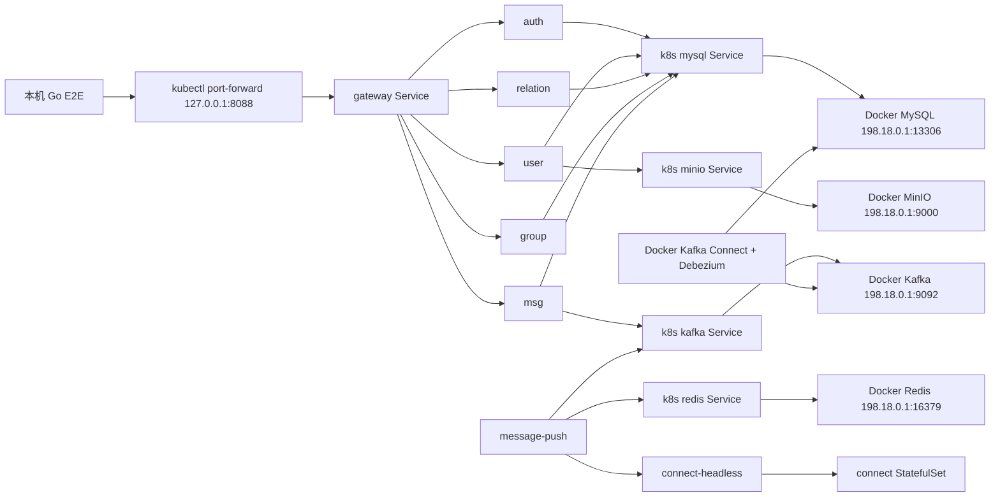

# k3s 本地部署与接口联调

本文记录当前 LCChat 在 Windows + WSL2 原生 k3s 环境下的本地部署方式、依赖边界、验证命令和当前接口联调进度。本文只描述当前可用方案，不再保留 k3d 兼容路径。

## 1. 当前目标

本地 k3s 联调的目标是：

1. 在 WSL2 中运行原生 k3s；
2. LCChat 应用服务部署到 k3s 的 `lcchat-dev` 命名空间；
3. MySQL、Redis、Kafka、Kafka Connect、Debezium、MinIO 继续复用 Windows Docker Compose；
4. 通过 Kubernetes `Service + Endpoints` 让 Pod 访问外部基础设施；
5. 通过 gateway 端口转发运行 Go 端到端功能测试。

## 2. 当前环境边界

| 类型 | 当前值 |
| --- | --- |
| Kubernetes | WSL2 原生 k3s |
| k3s API Server | `https://198.18.0.1:16443` |
| 应用命名空间 | `lcchat-dev` |
| 应用镜像 | `lcchat:dev-bin-4` |
| 应用入口 | `kubectl port-forward svc/gateway 8088:8080` |
| Docker Redis 宿主端口 | `16379 -> 6379` |
| Docker MySQL 宿主端口 | `13306 -> 3306` |
| Docker Kafka 宿主端口 | `9092 -> 9092` |
| Docker MinIO 宿主端口 | `9000 -> 9000` |

## 3. 部署拓扑



## 4. 基础设施要求

本地 k3s 不直接承载基础设施，以下容器需要通过 Docker Compose 保持运行：

```powershell
docker compose ps mysql redis kafka kafka-connect minio
```

当前期望状态：

| 服务 | 作用 | 期望状态 |
| --- | --- | --- |
| `mysql` | 账号、资料、关系、群组、消息等 MySQL 存储 | healthy |
| `redis` | Token、验证码、资料缓存、二维码、在线路由 | healthy |
| `kafka` | outbox、消息推送、实时提醒 topic | healthy |
| `kafka-connect` | Debezium CDC，把 `outbox_events` 转为 Kafka 事件 | healthy |
| `minio` | 头像等对象存储 | healthy |

`cdc-init` 是一次性注册任务，执行成功后会退出，属于正常现象。

## 5. CDC 与 outbox 注意事项

注册、资料更新、账号注销依赖 outbox + Debezium：

1. 服务先把事件写入 MySQL `outbox_events`；
2. Debezium connector 监听 MySQL binlog；
3. `EventRouter` 按 `event_type` 路由到 Kafka topic；
4. 下游服务消费 topic 并写入自己的本地表或冗余字段。

因此 `kafka-connect` 必须运行，且 connector 必须为 `RUNNING`：

```powershell
curl.exe -s http://127.0.0.1:8083/connectors/lcchat-outbox-connector/status
```

若 `user_created` 已写入 `outbox_events`，但 `user_profile` 没有新增记录，优先检查：

1. `docker compose ps kafka-connect` 是否 healthy；
2. `cdc-init` 是否注册成功；
3. Kafka topic 中是否存在 `user_created`；
4. user 服务消费者是否运行。

Windows 挂载脚本可能带 CRLF 行尾，`cdc-init` 已在容器内执行 `tr -d '\r'` 后再运行注册脚本，避免 shell 解析失败。

## 6. k3s 应用部署

当前 k8s dev overlay 使用：

```text
deploy/k8s/overlays/dev
```

关键配置：

- 应用命名空间：`lcchat-dev`；
- 所有应用副本数：`1`；
- 镜像标签：`lcchat:dev-bin-4`；
- 外部基础设施 Endpoint：`198.18.0.1`；
- Redis Endpoint 端口：`16379`；
- 不再使用 k3d Ingress，gateway 本地入口使用 port-forward。

常用命令：

```powershell
wsl -d Ubuntu-22.04 -- sudo kubectl apply -k /mnt/c/Users/23156/Desktop/go/LCChat/deploy/k8s/overlays/dev
wsl -d Ubuntu-22.04 -- sudo kubectl -n lcchat-dev get pods,svc,endpoints -o wide
```

导入本地镜像到 k3s containerd：

```powershell
docker save lcchat:dev-bin-4 -o lcchat-dev-bin-4.tar
wsl -d Ubuntu-22.04 -- sudo k3s ctr images import /mnt/c/Users/23156/Desktop/go/LCChat/lcchat-dev-bin-4.tar
```

临时 tar 包导入完成后应删除，避免提交大文件。

## 7. 本地访问方式

当前 gateway 推荐通过端口转发访问：

```powershell
wsl -d Ubuntu-22.04 -- sudo kubectl -n lcchat-dev port-forward svc/gateway 8088:8080
```

健康检查：

```powershell
curl.exe -s -o NUL -w "%{http_code}" http://127.0.0.1:8088/health
```

返回 `200` 表示 gateway 入口可用。

## 8. Kuboard 接入

Kuboard 已通过 ServiceAccount Token 导入原生 k3s 集群。

推荐方式：

1. 在 k3s 中创建 `kuboard-admin` ServiceAccount；
2. 绑定 `cluster-admin`；
3. 创建 `kubernetes.io/service-account-token` Secret；
4. 在 Kuboard 中选择 Token 方式导入集群。

注意：不要把 kubeconfig 私钥或 Token 写入仓库。临时 kubeconfig 文件使用后应删除。

## 9. 接口联调验证

接口联调统一使用 [`tests/e2e`](../../tests/e2e) 中的 Go 测试。先把 gateway
端口转发到 `127.0.0.1:8088`，再覆盖测试入口：

```powershell
$env:LCCHAT_E2E = '1'
$env:LCCHAT_BASE_URL = 'http://127.0.0.1:8088'
go test -tags=e2e `
  -run 'TestE2E/(认证与账号边界|好友与黑名单边界|消息与会话边界|群组权限与申请边界)$' `
  -count=1 -v ./tests/e2e
```

上述命令主动排除了会重启 Compose 服务的生命周期分组。完整 E2E 还需要可访问的
Connect、Redis 和 MySQL；对应地址通过
`LCCHAT_CONNECT_HTTP_BASE_URL`、`LCCHAT_CONNECT_WS_BASE_URL`、
`LCCHAT_REDIS_ADDR` 和 `LCCHAT_MYSQL_DSN` 覆盖。生命周期用例会执行
`docker compose restart connect` 和停止、恢复 Compose Redis，因此连接到 k3s
业务服务时应先用 `-run` 选择非生命周期分组，不要直接运行完整套件。

测试分组、环境变量和当前 Docker 基线见
[端到端功能测试](端到端功能测试.md)。
